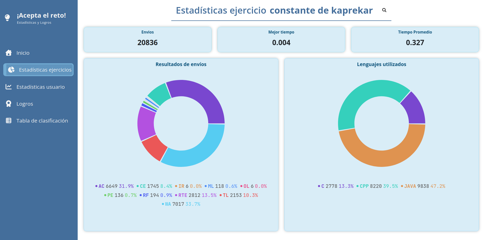
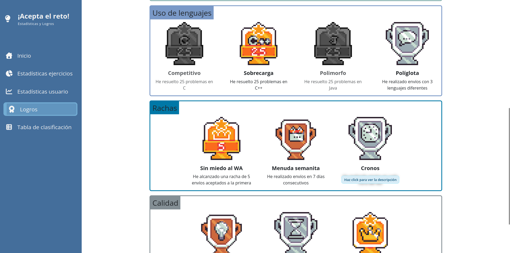
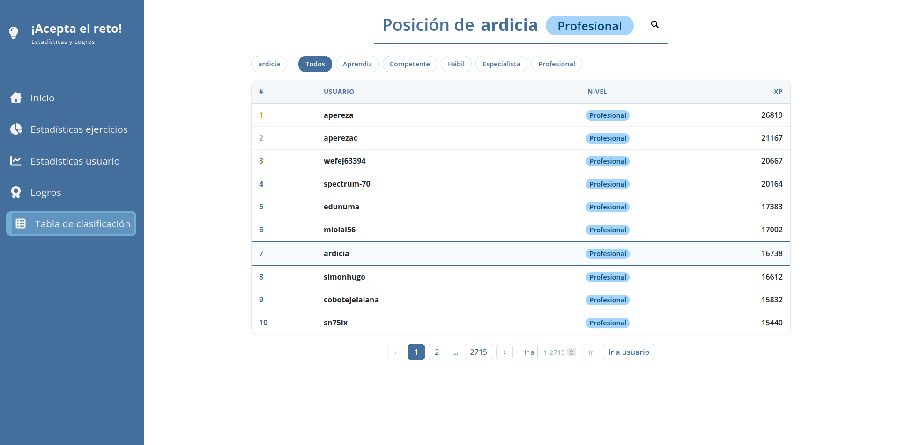

# Statistics and Achievements Panel for the Online Judge ¡Acepta el Reto!


[](https://github.com/jonatasemidio/multilanguage-readme-pattern/blob/master/README.md)

Índice:

- [Statistics and Achievements Panel for the Online Judge ¡Acepta el Reto!](#statistics-and-achievements-panel-for-the-online-judge-acepta-el-reto)
  - [Introduction](#introduction)
  - [Project structure](#project-structure)
  - [Installation and development](#installation-and-development)

## Introduction

The Statistics and Achievements panel for the online judge '¡Acepta el Reto!' (Accept the Challenge!) is a web application (React, Node.js) developed as a Bachelor's Thesis for the Software Engineering degree at the Complutense University of Madrid. It was developed by Néstor García Mayor, María Pajares Vázquez, and Inés Triviño Rello under the supervision of advisors Pedro Pablo Gómez Martín and Marco Antonio Gómez Martín.

The objective of this dashboard is to guide '¡Acepta el Reto!' users through their progress within the system and, more broadly, their journey in the field of competitive programming. To achieve this, a simple gamification system featuring experience points and achievements was implemented.

A deployed version of the application is available here: [https://dashboard.aceptaelreto.com/](https://dashboard.aceptaelreto.com/).





## Project structure

The project repository is divided into two main folders:

- Memoria (Report): Contains the LaTeX files used to create the project's written report, LaTeX compilation files, and some general information. The structure is based on the template provided by the Complutense University, which can be found here, along with its respective licensing and compilation info. The compiled thesis uses a CC-BY-SA license. The original images developed for this project (the achievement badges) were created using LibreSprite and are licensed under the same terms as the compiled project thesis.

- Aplicación (Application): Contains the files related to the application itself. This includes the code for the adapters, the application's backend and frontend, shared elements, virtual environments, Docker containers, the code license, etc.

## Installation and development

To develop the application, the following dependencies are necessary:

- [Docker](https://docs.docker.com/get-started/get-docker/), including the Docker Compose plugin
- [Node.js](https://nodejs.org/en/download) with npm

You can test whether you have the necessary dependencies using the following commands:

```bash
docker -v
docker compose version
node -v
npm --version
```

If any of these commands returns an error indicating that the order couldn't be found, double check your installation.

Once you are ready, follow these steps:

1. Start by cloning the repository into your own machine:

```bash
git clone https://github.com/inestrivino/Estadisticas-y-logros-Acepta-el-reto
```

2. In the terminal, enter the `Aplicacion` folder and execute the following command after making sure to have installed all the necessary dependencies using the `npm install` command:

```bash
npm start
```

3. Once you have started the application you can open a navigator and go to `http://localhost:3000/` to test it for yourself.

4. In VSCode you can also attach a debugger.

Now you are ready to make changes to the application. To close it, simply press `Ctrl+C` in the terminal where it was launched. Afterwards, you can use the `docker ps` command to verify that the container is no longer active.

For the development of the Thesis Report, it is recommended to read the `Gestionar LaTeX.txt` guide inside the `Memoria` folder. This guide provides instructions on how to manage a LaTeX project and includes the `compilar_latex.sh/.bat` scripts to generate the corresponding PDF locally. However, these are just tools to help you; development can be done in many valid ways (for example, in the cloud using a tool like Overleaf, and once the changes are finished, downloading and committing the corresponding files to the repository).
